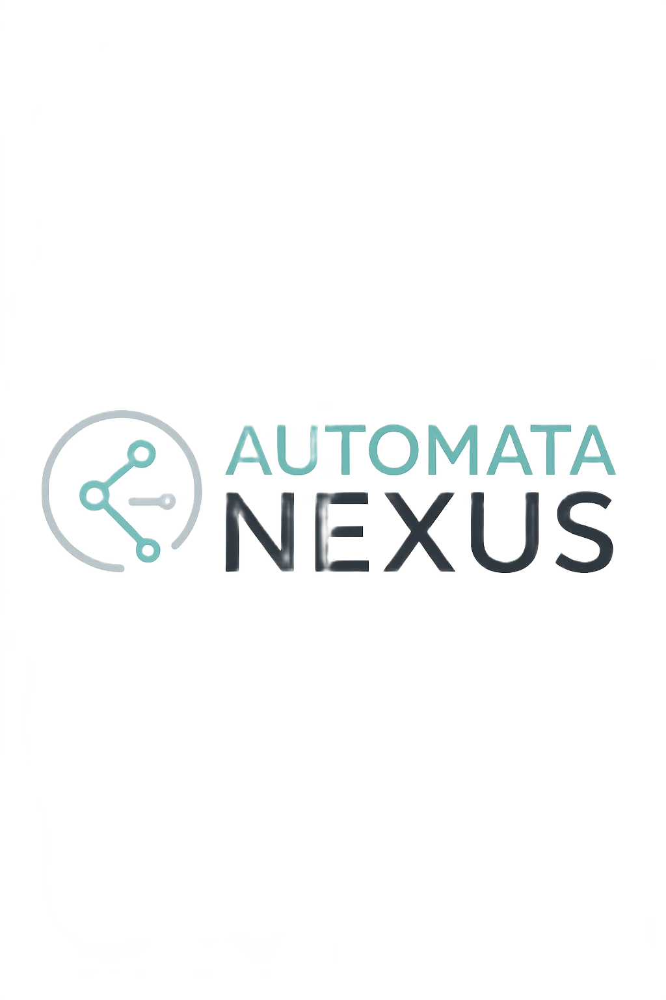

# Commercial Licensing Information



## 📋 License Options

### Professional License
- **Sensors**: Up to 10
- **Support**: Email support during business hours
- **Updates**: 1 year of updates included
- **Installation**: Single facility
- **Use Case**: Small to medium facilities
- **Price**: Contact sales

### Business License  
- **Sensors**: Up to 32
- **Support**: Priority email & phone support
- **Updates**: 2 years of updates included
- **Installation**: Multiple facilities (up to 3)
- **Training**: 4 hours remote training included
- **Use Case**: Large facilities, multi-site operations
- **Price**: Contact sales

### Enterprise License
- **Sensors**: Unlimited
- **Support**: 24/7 dedicated support
- **Updates**: Lifetime updates
- **Installation**: Unlimited facilities
- **Training**: On-site training available
- **Custom Features**: Available upon request
- **SLA**: 99.9% uptime guarantee
- **Price**: Contact sales

## 🔑 License Features Comparison

| Feature | Professional | Business | Enterprise |
|---------|-------------|----------|------------|
| Max Sensors | 10 | 32 | Unlimited |
| Node-RED Integration | ✅ | ✅ | ✅ |
| Web Dashboard | ✅ | ✅ | ✅ |
| REST API Access | ✅ | ✅ | ✅ |
| CSV Data Export | ✅ | ✅ | ✅ |
| Email Alerts | ✅ | ✅ | ✅ |
| SMS Alerts | ❌ | ✅ | ✅ |
| Custom Reports | ❌ | ✅ | ✅ |
| API Rate Limits | 1000/hour | 10000/hour | Unlimited |
| Data Retention | 30 days | 90 days | Unlimited |
| Custom Integrations | ❌ | Limited | ✅ |
| White Labeling | ❌ | ❌ | ✅ |

## 💰 Pricing Structure

### One-Time License Fee
- Perpetual license for the version purchased
- Includes specified support period
- Hardware not included

### Annual Maintenance (Optional)
- Continued software updates
- Extended support
- New feature releases
- 20% of initial license fee

### Volume Discounts
- 10+ licenses: 10% discount
- 25+ licenses: 20% discount  
- 50+ licenses: Contact for pricing

## 🚀 Getting Started

### 1. Contact Sales
Email: DevOps@automatacontrols.com
Phone: Contact for number
Web: https://automatanexus.com/contact

### 2. License Evaluation
- 30-day trial available
- Full features enabled
- Technical support included
- No credit card required

### 3. Purchase Process
1. Receive quote from sales team
2. Execute license agreement
3. Receive license key via email
4. Activate software with key
5. Begin monitoring

### 4. Activation
```bash
python universal_vibration_monitor.py --activate LICENSE_KEY
```

## 📝 Terms & Conditions

### Permitted Use
- ✅ Internal business operations
- ✅ Monitoring owned equipment
- ✅ Integration with internal systems
- ✅ Backup copies for archival purposes

### Prohibited Use
- ❌ Redistribution or resale
- ❌ Sharing license keys
- ❌ Reverse engineering
- ❌ Competitive analysis
- ❌ Service bureau use without agreement

### Support Scope
- Software configuration assistance
- Bug fixes and patches
- Integration guidance
- Best practices consultation
- Does NOT include:
  - Hardware troubleshooting
  - Custom development
  - On-site installation (unless purchased)

## 🔒 Security & Compliance

### Data Privacy
- All sensor data remains on-premise
- No cloud connectivity required
- Optional encrypted backups
- GDPR compliant architecture

### Industry Compliance
- ISO 10816 vibration standards
- Modbus RTU protocol
- REST API standards
- Industrial cybersecurity best practices

## 🤝 Partnership Opportunities

### System Integrators
- Referral programs available
- Technical training provided
- Co-marketing opportunities
- Volume pricing

### OEM Integration
- White label options
- Custom branding
- API integration support
- Embedded licensing

## 📞 Contact Information

**AutomataNexus AI & AutomataControls**

- **Sales**: DevOps@automatacontrols.com
- **Support**: support@automatacontrols.com  
- **Website**: https://automatanexus.com
- **Address**: Contact for details

### Business Hours
- Monday-Friday: 8:00 AM - 6:00 PM EST
- 24/7 support for Enterprise customers

---

*Building Intelligence Through Automation*

© 2025 AutomataNexus AI & AutomataControls. All Rights Reserved.